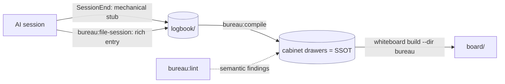

# bureau — plan

Turn AI sessions into a maintained, inspectable canon. Engine plugin (`bureau`) + workspace
data (`bureau/` in the user's repo) + the `whiteboard` renderer it depends on.

## Locked decisions

| Decision | Choice |
|---|---|
| Suite name | **bureau** (whiteboard keeps its name — it's the renderer) |
| Target | **both** software + story → profile-driven schema (`bureau.json.profiles`) |
| Capture granularity | one file per session under `logbook/YYYY/MM/` |
| Logbook rendering | **rendered** in the board, as its own drawer/section |
| Compile cadence | **both** — on-demand `bureau:compile` + opt-in `autoCompile` |

### Two consequences these forced
- **Flat sections.** whiteboard makes each top-level folder a nav section, so to render
  topic drawers *and* a logbook section in one board, drawers are direct children of the
  content dir. "Cabinets" is the collective name for the canonical drawers; `logbook/` is a
  drawer beside them. Authority is enforced by *which skill writes which drawer* + the
  `status:` frontmatter, not by a filesystem boundary.
- **Capture splits.** A `SessionEnd` hook is a shell command (no LLM), so capture = a
  mechanical **stub** (hook, guaranteed) + a rich **entry** (`bureau:file-session`, run in
  session where the agent has context).

## Authority model

- `cabinets/` (canonical drawers) — **authoritative** for *what's true now*. Co-authored,
  consistency-gated. Regenerable in principle.
- `logbook/` — **low authority**, faithful append-only record of *how we know / when it
  entered*. The provenance every cabinet claim links back to.

## Architecture

## On-disk formats

**Logbook entry** (append-only): frontmatter `title/updated/status:logbook/session/transcript`
+ body sections Intent / Decisions (each `→ [[Cabinet page]]`) / Changes / Open threads /
Source. See `skills/capture/SKILL.md`.

**Cabinet page** (SSOT): frontmatter `title/updated/status(canonical|draft|contested)/sources`
where `sources:` are `[[logbook/…]]` provenance links. A `contradicts:` typed edge +
`status: contested` is how an unresolved conflict surfaces — whiteboard's health lane already
renders it.

## Skills / commands / hooks

| Artifact | Phase | Status |
|---|---|---|
| `commands/init.md` | 0 | ✅ |
| `commands/inspect.md` | 0 | ✅ |
| `commands/file-session.md` + `skills/capture` | 1 | ✅ |
| `hooks/hooks.json` + `scripts/capture-stub.mjs` (SessionEnd → stub) | 1 | ✅ tested |
| `bureau:compile` skill | 2 | ☐ |
| `bureau:lint` skill | 3 | ☐ |

## Phase 2 — compile (the Karpathy compiler)

Trigger `bureau:compile` (on-demand; opt-in auto after capture). Read new logbook entries
(+ raw sources) → write/update the ~10–15 affected cabinet pages, update each drawer's index,
maintain backlinks, set `sources:` provenance. **Conflict policy:** a new fact contradicting a
`canonical` claim does NOT silently overwrite — flip the page to `status: contested`, record
both sides with provenance, add a `contradicts:` edge, surface to the human. End with a
`whiteboard build` structural check.

## Phase 3 — lint (semantic consistency)

Trigger `bureau:lint` (cadence / pre-milestone — NOT every keystroke; this is the LLM-judgment
check). Sweep the whole corpus for free-text contradictions, superseded claims, gaps, and
vocabulary drift. **Reuse the audit→fix→verify pattern** (fan-out finders + adversarial verify
before writing a finding; `Workflow` for parallel sweeps). Findings land as `contested`/health
items that whiteboard renders. Profile-aware: load the rule-set(s) named in `bureau.json`.

## Open / deferred
- Whiteboard invocation wiring: npm (`npx @xiaolai/whiteboard`) vs local checkout path —
  resolved in `bureau:inspect`, remembered in `bureau.json.whiteboardCli`.
- Profile drawer schemas (software vs story) — starter set scaffolded by `init`; refine.
- `autoCompile` is wired as a flag now; takes effect once Phase 2 lands.
