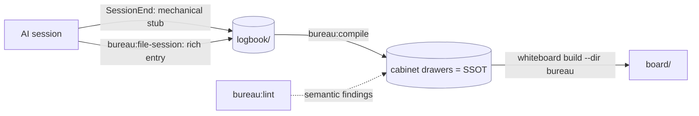

# bureau — plan

Turn AI sessions into a maintained, inspectable canon. Engine plugin (`bureau`) + workspace
data (`bureau/` in the user's repo) + the `whiteboard` renderer it depends on.

## Locked decisions

| Decision | Choice |
|---|---|
| Suite name | **bureau** (whiteboard keeps its name — it's the renderer) |
| Target | **both** software + story → profile-driven schema (`bureau.json.profiles`) |
| Capture granularity | one file per session under `logbook/YYYY/MM/` |
| Logbook rendering | **rendered** in the board, as its own drawer/section |
| Compile cadence | **both** — on-demand `bureau:compile` + opt-in `autoCompile` |

### Two consequences these forced
- **Flat sections.** whiteboard makes each top-level folder a nav section, so to render
  topic drawers *and* a logbook section in one board, drawers are direct children of the
  content dir. "Cabinets" is the collective name for the canonical drawers; `logbook/` is a
  drawer beside them. Authority is enforced by *which skill writes which drawer* + the
  `status:` frontmatter, not by a filesystem boundary.
- **Capture splits.** A `SessionEnd` hook is a shell command (no LLM), so capture = a
  mechanical **stub** (hook, guaranteed) + a rich **entry** (`bureau:file-session`, run in
  session where the agent has context).

## Authority model

- `cabinets/` (canonical drawers) — **authoritative** for *what's true now*. Co-authored,
  consistency-gated. Regenerable in principle.
- `logbook/` — **low authority**, faithful append-only record of *how we know / when it
  entered*. The provenance every cabinet claim links back to.

**Trust tiers (Phase 4).** Authority inside the cabinets is graded by the `status:` of each
page: `proposed` (AI claim, unchecked) → `verified` (auto-checked against the repo) →
`canonical` (human-approved, the only tier recalled as fact); plus `stale` (a verified source
changed) and `contested` (lint conflict). AI writes only `proposed`/`verified`; the
`proposed → review → canonical` gate is the double-check. The recall convention requires any
reader to honor the tier on every claim — `proposed`/`stale`/`contested` are never fact.

## Architecture

## On-disk formats

**Logbook entry** (append-only): frontmatter `title/updated/status:logbook/session/transcript`
+ body sections Intent / Decisions (each `→ [[Cabinet page]]`) / Changes / Open threads /
Source. See `skills/capture/SKILL.md`.

**Cabinet page** (SSOT): frontmatter `title/updated/status(canonical|draft|contested)`; a body
`**Sources.**` line with `[[session …]]` provenance links (in the BODY, because whiteboard's
backlinks panel indexes body links, not frontmatter lists). A `contradicts:` typed frontmatter
edge + `status: contested` is how an unresolved conflict surfaces — whiteboard's health lane
already renders it.

## Skills / commands / hooks

| Artifact | Phase | Status |
|---|---|---|
| `commands/init.md` | 0 | ✅ |
| `commands/inspect.md` | 0 | ✅ |
| `commands/file-session.md` + `skills/capture` | 1 | ✅ |
| `hooks/hooks.json` + `scripts/capture-stub.mjs` (SessionEnd → stub) | 1 | ✅ tested |
| `commands/compile.md` + `skills/compile` | 2 | ✅ |
| `commands/lint.md` + `skills/lint` | 3 | ✅ |
| `commands/review.md` + `skills/review` (trust tiers + gate) | 4 | ✅ |

## Phase 2 — compile (the Karpathy compiler) ✅

Trigger `bureau:compile` (on-demand; opt-in auto after capture). Read new logbook entries
(tracked by `_compile-state.json`) → write/update the affected cabinet pages, add each session
to the page's body `**Sources.**` provenance line. **Conflict policy:** a new fact
contradicting a `canonical` claim does NOT silently overwrite — flip the page to
`status: contested`, record both sides with provenance, add a `contradicts:` edge, surface to
the human. End with a `bureau:inspect` (whiteboard build) structural check. See
`skills/compile/SKILL.md`.

## Phase 3 — lint (semantic consistency) ✅

Trigger `bureau:lint` (cadence / pre-milestone — NOT every keystroke; this is the LLM-judgment
check). Sweeps the corpus for free-text contradictions, superseded claims, gaps, and vocabulary
drift, weighted by profile. **Reuses the audit→fix→verify pattern** — find → adversarially
refute → record only survivors (a false finding erodes trust). Writes a rendered
`lint/findings.md` report; with `--apply`, sets verified contradictions to `status: contested`
+ a `contradicts:` edge (whiteboard's health lane renders it) and superseded claims to `stale` —
status/edges only, never prose. See `skills/lint/SKILL.md`.

## Phase 4 — review (trust tiers + the human gate) ✅

The double-check between AI memory and trusted fact. Memory works like version control: an AI
claim is a PR (`proposed`), an automatic ground-truth check is CI (`verified`), human approval
is the merge (`canonical`), and a changed source is a broken check (`stale`). `compile` writes
only `proposed`/`verified` (a fact about an artifact is confirmed against the repo, fingerprint
recorded in `<workspace>/_verify.json`; a judgment stays `proposed`). `bureau:review` re-checks
staleness, presents a batch digest (facts apart from judgments), and on approval promotes to
`canonical` — the only tier recalled as fact. Rejection logs to the logbook, never erases. The
recall convention (in the workspace overview) makes the tier travel on every recalled claim.
See `skills/review/SKILL.md`.

## Open / deferred
- Whiteboard invocation wiring: npm (`npx @xiaolai/whiteboard`) vs local checkout path —
  resolved in `bureau:inspect`, remembered in `bureau.json.whiteboardCli`.
- Profile drawer schemas (software vs story) — starter set scaffolded by `init`; refine.
- `autoCompile` is wired as a flag; takes effect when a future hook/command opts in.
- Staleness re-check currently runs inside `bureau:review`; a standalone `bureau:verify` could
  run it on a cadence.
