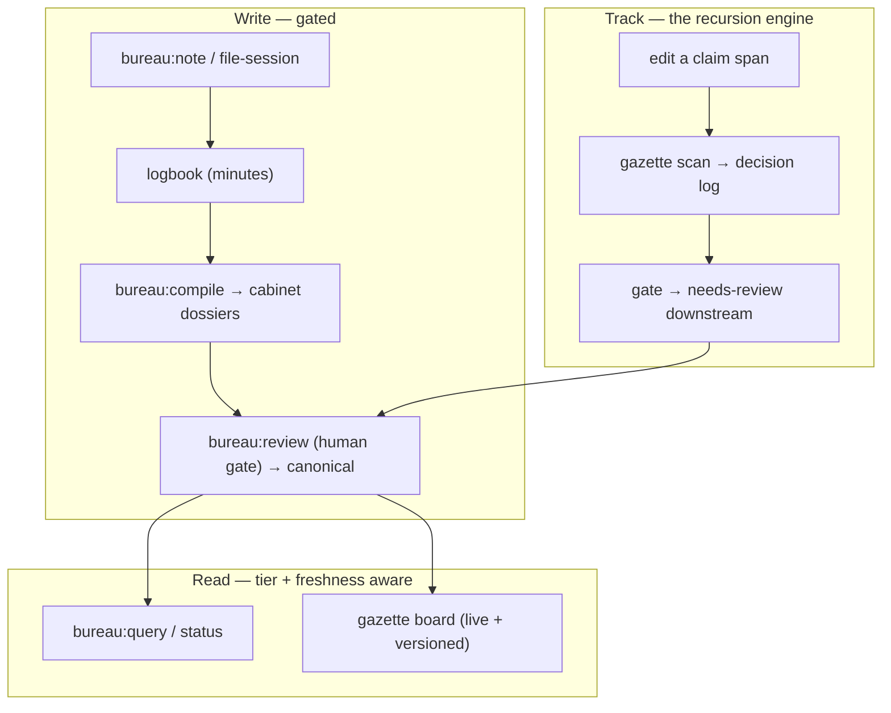

# bureau documentation

Turn AI sessions into a maintained, human-reviewed, *dependency-aware* knowledge base.

| Doc | Read it for |
|---|---|
| **[User Guide](user-guide.md)** | Start here — a 60-second quickstart, a worked example, the trust tiers, and what to run when. |
| **[The recursion engine](recursion-engine.md)** | How dependency-aware freshness works: opaque ids, `^spans`, `rests_on` edges, the scan → gate → review loop, the four-field state, and the honest limits. The flagship feature. |
| **[Live & versioned board](live-and-versioned-board.md)** | The live freshness board (`serve`), and git-backed versioning: render any past board (`build --at`), diff two versions (`diff`), pin named snapshots (`snapshot`). |
| **[CLI reference](cli-reference.md)** | Every `gazette` verb, grouped, with flags — and the on-disk artifact map (what's source vs derived). |
| **[ADR-0001 — engine data model](adr-0001-engine-data-model.md)** | The frozen data-model spec: the decision-log event grammar, the verdict key, and the frontmatter classes. The deep reference behind the engine guide. |

## The shape of it, in one picture

**Write** moves a claim through the gate (capture → compile → review); **track** keeps it honest as
its dependencies change; **read** answers from the canon, citing each claim's *trust tier* and its
*freshness*. `BUREAU.md` (written by `bureau:init`, imported from `CLAUDE.md`) binds every session to
the same rules.
