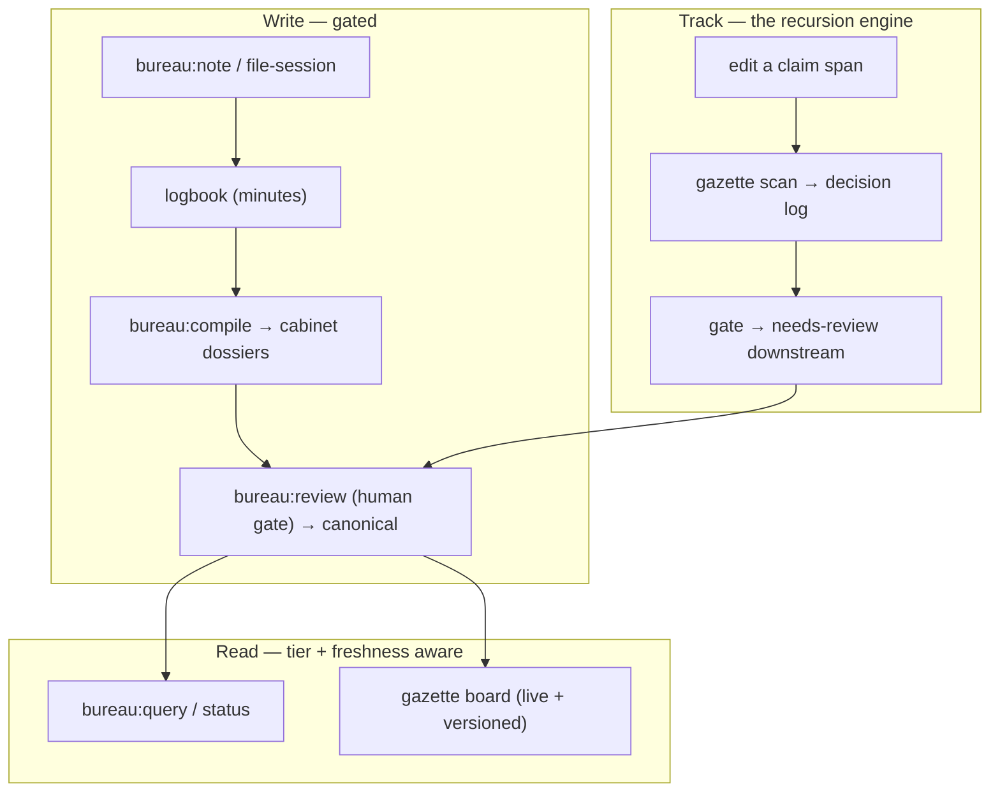

# bureau documentation

Turn AI sessions into a maintained, human-reviewed, *dependency-aware* knowledge base.

| Doc | Read it for |
|---|---|
| **[User Guide](user-guide.md)** | Start here — a 60-second quickstart, a worked example, the trust tiers, and what to run when. |
| **[The recursion engine](recursion-engine.md)** | How dependency-aware freshness works: opaque ids, `^spans`, `rests_on` edges, the scan → gate → review loop, the four-field state, and the honest limits. The flagship feature. |
| **[Live & versioned board](live-and-versioned-board.md)** | The live freshness board (`serve`), and git-backed versioning: render any past board (`build --at`), diff two versions (`diff`), pin named snapshots (`snapshot`). |
| **[CLI reference](cli-reference.md)** | Every `gazette` verb, grouped, with flags — and the on-disk artifact map (what's source vs derived). |
| **[ADR-0001 — engine data model](adr-0001-engine-data-model.md)** | The frozen data-model spec: the decision-log event grammar, the verdict key, and the frontmatter classes. The deep reference behind the engine guide. |
| **[ADR-0002 — canvas projection](adr-0002-canvas-projection.md)** | The board's graph projection: a deterministic topology layout rendered to SVG with level-of-detail tiers. The SVG is regenerable output, not a trust artifact. |
| **[ADR-0003 — external workspace](adr-0003-external-workspace.md)** | Keep a public repo's canon private: a path-free `.bureau-id` in the repo + a user-local mapping resolving to a workspace outside it. |
| **[ADR-0004 — decision-commit surface](adr-0004-decision-commit-surface.md)** | Content-bound approvals + projection-only trust: `canonical` is a projection of a logged human approve whose `reviewDigest` still matches; an edit past review goes stale. |
| **[ADR-0005 — review ergonomics](adr-0005-review-ergonomics.md)** | The typed review queue (`gazette review`, upstream-first, one action per page) + commit-gated batch approval (`approve --from` / `--all`). |
| **[ADR-0006 — ADR-native layer](adr-0006-supersedes-and-superseded-projection.md)** | `supersedes` edges + the projection-only, content-bound `superseded` state (fail-closed cycles, decisions-only targets), the `bureau:adr` scaffold, and the decision-filtered board view. |
| **[ADR-0007 — Codex-review lane](adr-0007-codex-review-lane.md)** | A `codex` machine-authority class (closing the `--by codex`-as-human footgun) + the `bureau:codex-review` orchestration: advisor mode (Codex advises, human commits) and opt-in delegate mode (Codex commits `--by codex`), content-bound and honest-courier. |

## The shape of it, in one picture

```mermaid
flowchart TD
  subgraph write["Write — gated"]
    N["bureau:note / file-session"] --> LB["logbook (minutes)"]
    LB --> CMP["bureau:compile → cabinet dossiers"]
    CMP --> REV["bureau:review (human gate) → canonical"]
  end
  subgraph track["Track — the recursion engine"]
    ED["edit a claim span"] --> SCAN["gazette scan → decision log"]
    SCAN --> GATE["gate → needs-review downstream"]
    GATE --> REV
  end
  subgraph read["Read — tier + freshness aware"]
    Q["bureau:query / status"]
    BRD["gazette board (live + versioned)"]
  end
  REV --> Q
  REV --> BRD
```

**Write** moves a claim through the gate (capture → compile → review); **track** keeps it honest as
its dependencies change; **read** answers from the canon, citing each claim's *trust tier* and its
*freshness*. `BUREAU.md` (written by `bureau:init`, imported from `CLAUDE.md`) binds every session to
the same rules.
