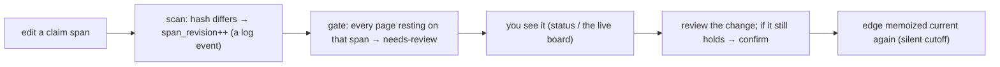

# The recursion engine — dependency-aware freshness

bureau's canon is prose, and prose drifts: a claim on one page rests on a claim on another, an
upstream fact changes, and the downstream page silently goes wrong. The **recursion engine** makes
that dependency *mechanical* — you declare which claim rests on which, and when an upstream claim
changes, every downstream page that depended on it is flagged for review. Deterministically, with a
human as the judge.

This is the piece that turns "a pile of markdown" into a *maintained* canon. It is built on an
explicit data model (see [`adr-0001-engine-data-model.md`](adr-0001-engine-data-model.md) for the
full spec); this guide is the practical how-to.

> **The one-line contract:** a **hash gate** decides *cheaply* whether an upstream claim actually
> changed; only then is anything flagged; a **human** decides whether the change matters; the verdict
> is **memoized** so it isn't re-asked until something real changes again. The gate is deterministic
> code — never an LLM guessing.

---

## The three things you author

Everything the engine does rests on three additions to an ordinary cabinet page:

### 1. An opaque `id:`

```yaml
---
id: 01J9Z8ULID…        # authored once, immutable, opaque
title: SSOT model      # the title is a mutable ALIAS, never the identity
trust: proposed
---
```

The page's identity is the `id`, **not** its title or path. Rename the page freely — every
dependency that points at it still resolves, because they point at the `id`. (A page with no `id:`
gets a stable derived one so nothing breaks before you stamp real ones.)

### 2. Author-anchored spans (`^anchor`)

Mark the *specific claim* other pages depend on with a `^anchor` at the end of its line:

```markdown
The wiki is authoritative for current truth; the logbook is low-authority provenance. ^ssot-claim
```

A span is the block ending at that anchor. Anchors inside code fences, `<pre>/<code>/<script>/<style>`
blocks, and headings are **not** spans (they'd be phantom claims).

### 3. `rests_on` dependency edges

On the *dependent* page, declare what it rests on — a bounded inline map naming the target page and
the exact span, with a `because`:

```yaml
---
id: 01J9ZB…
title: Query design
rests_on:
  - { page: "[[SSOT model]]", span: "^ssot-claim", because: "the query layer assumes the wiki is authoritative" }
---

# Query design
Answers come only from the compiled canon, never a raw file. ^query-claim
```

- An **object edge** (with a `span`) is **tracked** — the gate watches it.
- A bare string (`rests_on: "[[SSOT model]]"`) is **untracked** — recorded, but conservatively always
  `needs-review` (no span to anchor a verdict on). It is *excluded from the soundness guarantee*.
- An object edge **must** carry a `^span`, or it's a loud error — malformed data never slips through
  as "untracked."

---

## The freshness lifecycle

Once dependencies are declared, a page is always in one of four **freshness** states — derived, never
authored:

| freshness | meaning |
|---|---|
| `current` | every upstream span it rests on is unchanged since it was last confirmed |
| `needs-review` | it sits on an upstream span that changed (or was never confirmed), or its own claim moved |
| `stale` | a dependency is broken — the target page or span no longer exists |
| `modified` | (live board only) you've edited this page's own span but haven't recorded it yet |

The loop that moves a page between them:



Concretely:

1. **You edit** a claim. Running `gazette scan` diffs each span's content hash against the decision
   log and appends an **edit event**, bumping that span's `span_revision`. (A revert A→B→A bumps it
   too — the revision is a monotonic *count*, not a hash, so it can't be fooled by "changed back.")
2. **The gate** recomputes each edge's *verdict key* — a hash of `(target span + its revision, the
   dependent's claim + its revision, the `because`, schema version)`. Any component changing ⇒ the
   key changes ⇒ the dependent flips to `needs-review`. Nothing changing ⇒ **silent cutoff** (a
   cosmetic edit *outside* a cited span propagates to nobody).
3. **You review** the flagged page. If the upstream change doesn't actually break it, you
   **confirm** the edge — the current verdict key is memoized, and the page returns to `current`. It
   won't be re-flagged until something real changes again.

The **dirty mark is eager, the review is lazy**: `status`, `query`, and the board always consult the
freshness index, so a known-stale page can never quietly read as fact — but the *semantic* re-read is
only done when you choose to review.

---

## The four orthogonal state fields

The engine replaces the single overloaded `status:` with four independent axes (the legacy `status:`
still works and maps onto `trust`):

| field | values | who sets it |
|---|---|---|
| `trust` | `proposed \| verified \| canonical` | authored (`proposed`/`verified`); **`canonical` is a projection of a logged human approval**, never the frontmatter alone |
| `freshness` | `current \| needs-review \| stale` | derived by the gate |
| `conflict` | `none \| contested \| resolved` | projected from `resolve` events |
| `freeze` | `welded \| firm \| provisional \| thawed` | an authored change-priority hint |

A page can be `canonical` **and** `stale` at once — approved by a human, but sitting on a changed
upstream. That's the whole point: the two axes are independent.

**`canonical` is earned, not written.** `gazette fsck` flags any page authored `canonical` that no
`approve` event in the decision log backs — because the decision log, not the frontmatter, is the
source of truth for who approved what.

---

## The decision log — the source of truth

Everything above projects from one append-only file, `<workspace>/_log.jsonl`:

- It records the structural events (`introduce`/`edit`/`delete` of spans) and the human decisions
  (`approve`/`reject`/`confirm-edge`/`resolve`).
- It is **committed** — the source of truth for the mechanical state, and the input to time-travel.
- It is **tamper-evident**: each line chains to the previous by a hash, so a rewritten past line is
  detected by `fsck`.
- Everything else the engine knows (freshness, revisions, verdict keys, the `.bureau-cache/` gate
  cache) is a *pure function* of `(the authored pages + this log)` and rebuilds to a **byte-fixpoint**
  — drop the cache, run `fsck`, get identical bytes. That regenerability is a release gate.

Never hand-edit `_log.jsonl`.

---

## The commands

Run these via the bundled press (`node "${CLAUDE_PLUGIN_ROOT}/press/bin/gazette.mjs" <verb>`; from a
bureau repo the workspace is auto-detected, so `--dir` is optional). See
[`cli-reference.md`](cli-reference.md) for every flag.

| verb | what it does |
|---|---|
| `scan` | record span-revision events for anything that changed since the last scan |
| `gate` | show the eager dirty index — which pages are `needs-review`/`stale`, and why |
| `report` | deterministic, auditable metrics (kill rate, cutoff ratio *beside* edge count, fixpoint digest) |
| `fsck` | rebuild all derived state to a byte-fixpoint; a CI gate (fails on drift/tamper/unbacked-canonical) |
| `approve "<title>"` | log a human approval → backs `trust: canonical` |
| `confirm "<title>"` | vouch that a page's open `rests_on` edges still hold → cutoff |
| `resolve "<A>" "<B>" --winner "<title>"` | record which side of a `contradicts` wins |
| `ledger …` | the code-owned trust ledgers (`_verify.json` fingerprints, `_compile-state.json`) |

In the bureau workflow you rarely run these raw: `bureau:status` surfaces the gate, `bureau:review`
drives `approve`/`confirm`/`resolve`, and `bureau:cycle` runs `scan` as part of the pipeline.

---

## The honest limits (read these)

The engine is deterministic and sound **within a boundary**, and it does not pretend past it:

- **Soundness rests on edge *completeness*, which is undecidable for hand-declared prose.** If you
  forget to declare a dependency, the gate can't flag it — *under-scoping is the silent killer.* The
  gate can **exclude** drift (a hash proves an upstream span didn't change); it can never **prove**
  you declared every dependency. Over-scoping annoys (false positives); under-scoping resurrects
  silent staleness. Declare generously.
- **The hash gate measures change, not meaning.** Whether a change actually *invalidates* the
  downstream claim is a human judgment (an LLM at that job is measurably weak). The gate flags;
  you decide.
- **Only mechanical state is regenerable.** `fsck` rebuilds indexes, revisions, and verdict keys to
  a byte-fixpoint. Human/LLM decisions live in the log as *inputs* — they are verified *present*, not
  rebuilt. bureau never claims to regenerate a human's approval.
- **Untracked edges are outside the guarantee.** A bare-string `rests_on` (or a tracked edge whose
  dependent anchors no claim span) is conservatively `needs-review` and reported as *untracked* — it
  never counts toward the cutoff ratio, so the metrics can't flatter themselves by dropping edges.

The rule of thumb: **the hash stays the gate, the human stays the judge, and every number reports its
own scope.** That restraint is the product.
